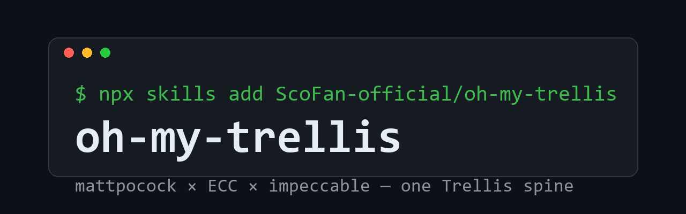

<p align="center">
  
</p>

<p align="center">
  <strong>The agent skill pack with a workflow spine.</strong>
</p>

<p align="center">
  <a href="https://github.com/ScoFan-official/oh-my-trellis/stargazers"></a>
  
  
  
  <a href="https://github.com/ScoFan-official/oh-my-trellis/commits"></a>
</p>

<p align="center">
  <strong>English</strong> · <a href="./README.zh-CN.md">简体中文</a> · vendored under MIT &amp; Apache-2.0 — see <a href="catalog/ATTRIBUTION.md">ATTRIBUTION</a>
</p>

Advisory skills don't ship design systems — contracts do. oh-my-trellis vendors
[mattpocock/skills](https://github.com/mattpocock/skills),
[Everything Claude Code](https://github.com/davila7/claude-code-templates) and
[pbakaus/impeccable](https://github.com/pbakaus/impeccable) into one repo, then
binds their loose nouns — "the issue tracker", "PRODUCT.md", "DESIGN.md" — to
Trellis's `.trellis/` spine so the workflow is enforced, not suggested.

**3** vendored upstreams · **1,741** catalog assets · **41** default skills · **22** platforms · **1** contract layer — zero patches to vendored files.

---

## Install

| You want… | Run |
| --- | --- |
| The Trellis contract specs only | `trellis init --registry gh:ScoFan-official/oh-my-trellis/marketplace --template agent-workflow --append` |
| The recommended skill set (all 37 mp skills + impeccable + the pack's own `mp-trellis-bridge` / `oh-my-update` / `trellis-domains`) | `npx skills add ScoFan-official/oh-my-trellis --agent <platform> --copy` |
| Anything else from the 1,741-asset catalog | `python scripts/install.py --platform <platform> --target <repo>` |

Repo is public — all three channels work without auth. Mix and match freely.

### One-sentence install prompt (paste to your agent)

Hand this to Devin / Codex / ZCode / Claude / Cursor and it will set everything up itself:

> Set up Trellis and oh-my-trellis in this repo: ① install our Trellis CLI and init — `npm i -g https://github.com/ScoFan-official/oh-my-trellis/releases/download/cli-v0.6.17-ohmy.2/oh-my-trellis-0.6.17-ohmy.2.tgz` (if `@mindfoldhq/trellis` is already installed globally, `npm rm -g @mindfoldhq/trellis` first — our package owns the `trellis` bin), then `trellis init --devin` — registry and workflow defaults are baked into the fork; ② run `trellis init --template agent-workflow --append` to install the spec contracts; ③ install the skills for YOUR platform — prefer `npx skills add ScoFan-official/oh-my-trellis --agent <your-platform> --copy`; if your platform isn't covered, run `git clone --depth 1 https://github.com/ScoFan-official/oh-my-trellis /tmp/mtp && python /tmp/mtp/scripts/install.py --platform <your-platform> --target . --only-core` instead; ④ invoke the `mp-trellis-bridge` skill so it finishes seeding `AGENTS.md`, then read `.trellis/spec/agents/issue-tracker.md` and report back which tracker verbs you'll use for specs, tickets, triage and implementation. To update later, invoke the `oh-my-update` skill.

For non-Trellis repos, skip to skills only:

> Install the mattpocock skill set here: `npx skills add ScoFan-official/oh-my-trellis --agent <your-platform> --copy`, then browse `catalog/INDEX.md` in https://github.com/ScoFan-official/oh-my-trellis and install extra components for this platform with `scripts/install.py` if needed.

---

## 01 · The contract — Trellis spec registry

Skills that say *"publish to the issue tracker"* get pointed at `.trellis/tasks/`.
Skills that say *"update PRODUCT.md / DESIGN.md"* get pointed at `.trellis/spec/`.
Delivery is index-driven: Trellis's session-start hook injects the spec
packages' `index.md` files, and the agent reads each contract the index lists —
`agents/index.md` first. The frontend gate is mechanical: the CLI refuses to
archive a frontend task whose `implement.md` carries no `## Design review`
section.

```bash
trellis init --registry gh:ScoFan-official/oh-my-trellis/marketplace --template agent-workflow --append
```

Installs into `.trellis/spec/`:

```
.trellis/spec/
├── agents/
│   ├── index.md
│   ├── issue-tracker.md      # THE contract — read before publishing to the tracker
│   ├── triage-labels.md      # five roles → meta.triage / Status: lines
│   ├── frontend-craft.md     # impeccable binding + the mechanical design-review gate
│   └── domain.md             # GLOSSARY.md + docs/adr/ conventions
└── guides/
    └── mp-integration.md     # phase map, lane rules, skill precedence (pull-mode doc; guides/index.md stays yours)
```

Each package ships an `index.md`; the session-start hook injects those indexes,
and the agent reads the contracts they list. The contracts themselves are
pull-mode docs — nothing parses per-file path globs.
`--append` adds missing files only — safe on existing spec trees.
After install, the files are yours to edit (Trellis's project-ownership model).

## 02 · The skill set — skills CLI

```bash
npx skills add ScoFan-official/oh-my-trellis --agent <platform> --copy
```

Installs **41 skills** — mattpocock's full collection
(engineering, productivity, misc, in-progress) plus `impeccable`, the frontend
design workflow, plus the pack's own `mp-trellis-bridge`, `oh-my-update` and
`trellis-domains`. `--agent` accepts `devin`, `codex`, `claude`, `cursor`, and
the other platforms the skills CLI knows.

`mp-trellis-bridge` is a bootstrapper + routing contract: on first load it
verifies `.trellis/`, installs the channel-1 spec contracts (registry first,
bundled templates as fallback), appends an `## Agent skills` block to
`AGENTS.md`, and checks the mp skills are present. No-op afterwards.

## 03 · The catalog — install.py

`scripts/install.py` materializes any subset of the catalog into a target repo,
converted to that platform's native format.

```bash
# Inventory
python scripts/install.py --list
python scripts/install.py --list --platform codex      # + where things land

# Everything, one platform
python scripts/install.py --platform codex --target /path/to/repo
python scripts/install.py --platform devin --target /path/to/repo
python scripts/install.py --platform zcode --target /path/to/repo

# Recommended core only (bridge + mp main skills, no in-progress/misc)
python scripts/install.py --platform zcode --target . --only-core

# Surgical picks — by id, by name, or by glob
python scripts/install.py --platform claude --target . \
  --component "ecc:agents/security/*" "ecc:commands/git-workflow/commit" "mp:engineering/tdd"

# Filter by type or source
python scripts/install.py --platform cursor --target . --type skill agent
python scripts/install.py --platform copilot --target . --source mp

# Preview
python scripts/install.py --platform devin --target . --dry-run
```

Flags: `--platform` (required), `--target` (repo root, default `.`),
`--type skill|agent|command|mcp`, `--source mp|ecc`,
`--component <id|name|glob>`, `--only-core`, `--dry-run`, `--list`.

**Asset IDs** follow `source:type-path`: `mp:engineering/tdd`,
`ecc:skills/development/api-design-principles`,
`ecc:agents/security/security-auditor`, `ecc:commands/git-workflow/commit`,
`ecc:mcps/database/dbhub`. Full IDs live in `catalog/manifest.json`.

### What lands where (per platform)

- **skills** → `<platform skills dir>/<name>/` — plain folder copy (universal format)
- **agents** → platform's sub-agent file + converted frontmatter
- **commands** → platform's command/workflow/prompt file, or a user-invocable
  skill (`ecc-<name>/SKILL.md` with `disable-model-invocation`) on platforms
  with no command primitive
- **mcps** → merged into the platform's MCP JSON config; Codex gets
  `.codex/mcp-<name>.toml` snippets to merge into `config.toml`

## How components get triggered

| Type | Trigger model | You say… |
| --- | --- | --- |
| skills (889) | **Semantic auto-match**: platform injects each SKILL.md's `name`+`description` into the agent's available-skill list; it self-loads when your task matches ("something is broken" → `diagnosing-bugs`). Explicit mention also works. | "debug this" or "use `api-design-principles`" |
| commands (288) | **Explicit**: with a native command primitive → platform command syntax; without (codex/devin/kiro) → wrapped as `disable-model-invocation` skills, invoked by name. | "/ecc-commit" or "run `ecc-commit`" |
| agents (422) | **Delegation**: platform's sub-agent mechanism (Claude `Task`, Codex subagents); auto-delegated on description match or invoked by name. **Skipped on devin/kilo/antigravity** (no primitive — read the body as an inline persona if needed). | "have `security-auditor` review this" |
| mcps (104) | **Config activation**: merged into platform MCP config, handshake on restart, tools join the toolbox. Most need credentials — fill `<your-...>` placeholders first. | tools just appear |

**Don't bulk-install all 889 skills** — every name+description costs system-prompt space and dilutes matching precision. Use `--only-core` or `--component` picks; treat `catalog/INDEX.md` as the shelf and pull from it as needed.

## Platform support (22)

| Platform | skills dir | sub-agents | commands | mcp | status |
| --- | --- | --- | --- | --- | --- |
| claude | `.claude/skills` | `.claude/agents/*.md` | `.claude/commands/ecc/*` | `.mcp.json` | ✅ verified |
| cursor | `.cursor/skills` | `.cursor/agents/*.md` | `.cursor/commands/ecc-*` | `.cursor/mcp.json` | ✅ |
| opencode | `.opencode/skills` | `.opencode/agents/*.md` (+`permission:`) | `.opencode/commands/ecc/*` | `opencode.json` | ✅ |
| **codex** | `.agents/skills` | `.codex/agents/*.toml` (`developer_instructions`) | → skills | `.codex/mcp-*.toml` | ✅ |
| kiro | `.kiro/skills` | `.kiro/agents/*.json` | → skills | `.kiro/settings/mcp.json` | ✅ |
| gemini | `.agents/skills` | `.gemini/agents/*.md` | `.gemini/commands/ecc/*.toml` | `.gemini/settings.json` | ✅ |
| qoder | `.qoder/skills` | `.qoder/agents/*.md` | `.qoder/commands/ecc-*` | `.qoder/mcp.json` | ✅ |
| codebuddy | `.codebuddy/skills` | `.codebuddy/agents/*.md` | `.codebuddy/commands/ecc/*` | `mcp.json` | ✅ |
| copilot | `.github/skills` | `.github/agents/*.agent.md` | `.github/prompts/*.prompt.md` | `.vscode/mcp.json` | ✅ |
| droid | `.factory/skills` | `.factory/droids/*.md` | `.factory/commands/ecc/*` | `.factory/mcp.json` | ✅ |
| pi | `.agents/skills` | `.pi/agents/*.md` | `.pi/prompts/ecc-*` | `.pi/mcp.json` | ✅ |
| **devin** | `.devin/skills` | — (no primitive; inline) | `.devin/workflows/ecc-*.md` | `.devin/mcp.json` | ✅ |
| kilo | `.kilocode/skills` | — (inline) | `.kilocode/workflows/ecc-*` | `.kilocode/mcp.json` | ✅ |
| **zcode** | `.zcode/skills` | `.zcode/agents/*.md` (no `tools:`) | `.zcode/commands/ecc-*` | `.zcode/mcp.json` | ⚠️ partial |
| omp / reasonix / trae / grok / kimi / snow / dsh / antigravity | `.X/skills` (resp.) | `.X/agents/*.md` (conv.) | `.X/commands|workflows/ecc-*` | `.X/mcp.json` | ⚠️ convention |

✅ = file locations follow Trellis's documented per-platform tables.
⚠️ = convention-based guesses (`verified: false` in `scripts/platforms.py` /
`manifest.json`); treat generated agent/command files as drafts to review.
`zcode` agents are verified against the real Trellis zcode template; its
commands/MCP paths are conventional.

---

## Asset catalog — what's inside

**Per-component "when to use":** see [`catalog/INDEX.md`](catalog/INDEX.md) —
an auto-generated index where every one of the 1,741 components carries its
own description ("use when…") extracted from its source frontmatter.
Regenerate with `python scripts/build_index.py`.

### mattpocock skills — 37 (+ the pack's own)

The engineering spine of the pack. Main flow: *grill → spec → tickets →
implement → retro*, with two intake ramps and standalone utilities.

| Skill | When to use |
| --- | --- |
| `ask-matt` | Router — "which skill fits my situation?" Ask first when unsure. |
| `grill-with-docs` | Align on an idea: agent interviews you through a design tree, lands terms in `GLOSSARY.md` + decisions in `docs/adr/`. Always use in-repo (over `grill-me`). |
| `grill-me` / `grilling` | Same interview, no doc side-effects (no working dir). `grilling` is the engine; `grill-me` the user-invoked entry. |
| `to-spec` | Freeze a grilled conversation into a spec (Problem/Solution/User Stories/Decisions) → Trellis task + `prd.md`. |
| `to-tickets` | Slice a spec into tracer-bullet tickets → child tasks + `blocked_by` meta. Confirm the split before it writes. |
| `implement` | Build one ticket: TDD red-green inside pre-agreed seams → typecheck/tests → code-review → commit. One ticket per session. |
| `implement-spec` | Batch-orchestrate a whole spec's ticket graph (integration branch + parallel worktrees). On Devin, run sequentially or via `run_subagent`. |
| `tdd` | Red-green-refactor loop, embedded inside `implement`. |
| `code-review` | Two-axis review (Standards + Spec) of changes since a ref. Complements `trellis-check`. |
| `codebase-design` | Deep-module vocabulary (interface/depth/seam/deletion test) for design discussions. |
| `improve-codebase-architecture` | Scan for shallow modules → visual HTML report → grill through a pick. Run every few days on growing code. |
| `diagnosing-bugs` | Hard bugs/regressions: failing reproduction first, then hypothesize-instrument-fix-regress. |
| `domain-modeling` | Build/maintain `GLOSSARY.md` + ADRs; fires lazily inside grill/wayfinder. |
| `research` | Delegate a question to high-trust sources → markdown findings file. |
| `prototype` | Throwaway prototype to answer a design question (the grill↔prototype loop). |
| `triage` | Triage external reports: `needs-triage→needs-info/ready-for-agent/ready-for-human/wontfix`. Inbox in `.scratch/`, promote to tasks. |
| `wayfinder` | Fog-level projects: parent task + `map.md` + decision tickets (research/prototype/grilling/task), max one resolved per session. |
| `retro` | Post-build env tune-up: navigation pointers, deterministic checks, review checklists. |
| `handoff` | Compress session → handoff doc for the next agent/session; auto-redacts secrets. |
| `teach` | Turn a directory into a multi-session learning workspace (mission→resources→lessons→records). |
| `to-questionnaire` | Turn a stuck decision into a markdown questionnaire for the right human. |
| `wait-what` | "Re-explain that" — simplified technical English + glossary terms. |
| `writing-for-agents` | Authoring/editing skills, AGENTS.md, CLAUDE.md. |
| `pr` / `wizard` | PR body; interactive bash wizard for human-only steps (infra, dashboards). |
| `setup-matt-pocock-skills` | Legacy bootstrapper for plain (non-Trellis) repos — superseded here by `mp-trellis-bridge`. |
| `claude-handoff`, `loop-me`, `setup-ts-deep-modules`, `writing-beats`, `writing-fragments`, `writing-shape` | in-progress collection — usable but less polished. |
| `git-guardrails-claude-code`, `migrate-to-shoehorn`, `scaffold-exercises`, `setup-pre-commit` | misc — platform-specific or niche. |
| `mp-trellis-bridge` | **Ours.** The contract + router binding all of the above to Trellis. |
| `oh-my-update` | **Ours.** Gate-checked update of the whole stack — fork CLI, `.trellis/` templates, installed skills, `.trellis/spec/` — to the latest ScoFan-official releases. |
| `trellis-domains` | **Ours.** Thin shell over the `.trellis/domains/` layer — 归口 routing, board flag, takeover read-chain, worklog/收工 and 对账 checklists that point at the repo's `DISCIPLINE.md` / `WORKLOG-PROTOCOL.md` / `REGISTRY.md` (the protocol text never lives here). |

### impeccable — 1 skill, 24 commands (frontend design)

[pbakaus/impeccable](https://github.com/pbakaus/impeccable), Apache-2.0 — the
frontend craft workflow. Vendored **markdown-only**: the `/impeccable <cmd>`
skill (`shape`, `craft`, `critique`, `audit`, `polish`, `bolder`, `typeset`…)
works on every platform; the 61 deterministic detector rules, `live`, `generate`,
`hooks`, `doctor` and the `impeccable context` boot loader need upstream's
engine — `npx impeccable install` in the target project. Without it, commands
fall back to the skill's built-in degraded mode.

In Trellis repos, `agents/frontend-craft.md` binds impeccable's artifacts:
PRODUCT.md → `.trellis/spec/product.md`, DESIGN.md → `.trellis/spec/design-system.md`;
wires `shape → craft → audit+critique → polish` into the phases; and gates
frontend tasks — no `## Design review` section in `implement.md`, no READY.

### ECC (Everything Claude Code) — 1,703 components

Largest community catalog of agent components (aitmpl.com). Counts are real,
from `install.py --list`:

| Type | Count | Top categories | Notes |
| --- | --- | --- | --- |
| skills | **889** | development 230, scientific 135, ai-research 131, productivity 50, business-marketing 48, security 47, creative-design 33, enterprise-communication 33, web-development 30, career 21… | SKILL.md dirs w/ references/scripts; copy to any platform's skills dir |
| agents | **422** | expert-advisors 52, programming-languages 50, devops-infrastructure 40, data-ai 40, development-tools 35, security 25, business-marketing 21, development-team 18, deep-research-team 16, web-tools 16… | Claude md → converted per platform |
| commands | **288** | google-workspace 47, utilities 21, project-management 20, testing 17, svelte 16, orchestration 15, git-workflow 14, sync 14, team 14, deployment 11… | Claude commands → converted/wrapped |
| mcps | **104** | devtools 49, web-data 10, database 8, integration 8, browser_automation 6, web 6, productivity 5… | `mcpServers` JSON snippets |

Not ported (kept in `catalog/` as reference, Claude-Code-specific):
**hooks 81**, **settings 75**, **mods ~40**, **sandbox 23** (cloudflare/docker/e2b), **loops 18**.

Every component's when-to-use: [`catalog/INDEX.md`](catalog/INDEX.md).

## Repo layout

```
marketplace/            # channel 1: Trellis spec registry (index.json + agent-workflow)
skills/                 # channel 2: npx-skills surface — pack-owned skills + 37 mp skills + impeccable
catalog/
├── INDEX.md            # generated: every component + when-to-use
├── manifest.json       # generated: every asset → per-platform target paths
├── upstream.json       # pinned upstream SHAs
├── ATTRIBUTION.md      # MIT provenance
├── mattpocock/         # skills(4 collections) + docs + .claude-plugin + .agents + LICENSE
├── impeccable/         # skills/impeccable + docs + LICENSE + NOTICE.md (Apache-2.0)
└── ecc/                # skills agents commands mcps hooks loops mods settings sandbox + LICENSE
scripts/
├── platforms.py        # 22-platform location table (single source of truth)
├── install.py          # materialize catalog → platform-native files
├── build_manifest.py   # regen manifest.json
├── build_index.py      # regen INDEX.md
└── sync_upstream.py    # re-vendor upstreams (--check = drift report)
```

## Updating

Consumers: single entry point — the **`/oh-my-update`** workflow (Devin) or
the `oh-my-update` skill (`skills/oh-my-update/`). It checks the fork CLI
against this repo's `cli-v*` releases (the CLI tarball channel lives here
alongside pack `v*` releases), refreshes installed skills and
appends spec contracts, with a confirm gate. Layer-specific fallback:
`npx skills add ScoFan-official/oh-my-trellis --agent <platform> --copy`.

Pack maintainers (re-vendoring upstreams):

```bash
python scripts/sync_upstream.py --check   # did upstreams move?
python scripts/sync_upstream.py           # re-vendor catalog/ (overwrites catalog only)
python scripts/build_manifest.py && python scripts/build_index.py
```

Installed spec files are project-owned (Trellis model) — merge upstream spec
changes intentionally. `catalog/` is vendored; never patch it in place.

## Requirements

- Python 3.8+, git
- `npx skills` (Node.js) for channel 2
- A Trellis-managed repo only for channel 1 (the spec registry)
- Claude-format extras (hooks/settings/etc.) require Claude Code to use as-is

## FAQ

**Private/forked copies?** Repo is public — all three channels work without
auth. Fork to pin your own snapshot; swap `--registry gh:you/fork`.

**Which platform am I on?** `install.py --list --platform X` prints where each
asset type lands for that platform before you install anything.

**Too many skills?** Channel 3 defaults to your explicit selection; `--only-core`
gives the ~28-skill recommended set. `npx skills add --skill <name>` installs
single skills from `skills/`.

**Found a wrong platform path?** Fix `scripts/platforms.py` — it's the single
source of truth — then rerun `install.py` and `build_manifest.py`.
